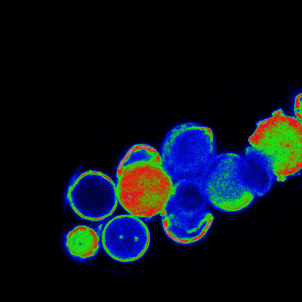

## ABOUT JASMINA DZURLIC

Jasmina Dzurlic is a M.A. candidate in the department of Ecology, Evolution, and Environmental Biology (E3B) (http://e3b.columbia.edu) at Columbia University. She is an active researcher in the Naeem-Palmer Lab and the Eaton Lab (https://eaton-lab.org/people/) with interests in plant biodiversity and genetic variation within species. Broadly, Jasmina’s primary research is investigating speciation genetics in Amaranthus. 

Fluorescent microscopy and Flow Activated Cytometry (FACS) is used to quantify pollen viability in F1 hybrids. Genome wide associations (GWAS) are performed to determine the influence of sex determination genes in reproductive compatibility between dioecious and hermaphroditic species.

Bioinformatic pipelines are used to analyze sequence data and identify sex-markers in the genomes of the experimental Amaranthus population. In summary, Jasmina’s research is aimed to enhance the understanding of speciation genetics in Amaranthus and develop computational methods for constructing quantitative trait locus (QTL) maps using whole genome sequence data.

## PHYLOGENETIC RESEARCH

Amaranthus is a morphologically diverse genus of flowering plants that is both a nutritional-rich crop and yield-affecting weed dependent on the species and context. Present-day evolution of a dioecious mating system has not been extensively examined at the molecular level. Complex patterns of reproductive compatibility and hybridization have implications for taxonomy and inform mechanism of speciation in Amaranthus.

Genetic systems govern the differentiation of male and female floral parts in all organisms. In angiosperms, most sex determination is expressed in morphology of pistillate and staminate flowers with respective floral morphology. Sex-determining loci are highly conserved and often the first of genes to be mapped when constructing linkage maps of species. Genome-wide association studies (GWAS) are used to identify candidate loci in genomes to make genotypic and phenotypic inferences. Jasmina is performing a GWAS to identify sex loci in dioecious Amaranthus. The loci, structures, and homology between male and female sequences within and between species will provide insight into the genetic mechanisms of sex determination and evolution of dioecy.

Pollen viability is used as a measurement of genetic distance and reproductive compatibility between species. Jasmina is using 4′,6-diamidino-2-phenylindole (DAPI) and Reactive Oxygen Species (ROS) fluorescent dies to stain pollen to measure fluorescence as an indicator of viability. Cell imagining is performed using the LSM 700 laser scanning confocal microscope with a variable dichromatic mirror that enables spectral imaging coupled with linear unmixing to untangle highly overlapping emission spectra. The overlapped  spectra emits signature wavelengths produced by absorbed fluorophores that reemit light upon excitement. 

Fluoresced regions of 4′,6-diamidino-2-phenylindole illustrate regions of relatively high concentrations of DNA content compared to less brilliant grains or cells. Lastly, Jasmina processes the Ziess cellular photographs in Zenn software to create 2-D maps of spectral emissions to approximate haploid viability. 

## COOL NEIGHBORHOODS NYC: QUANTIFYING URBAN TREE HEALTH AND SERVICES IN HEAT VULNERABLE AREAS

Urban street trees mitigate the effects of heat by providing ecosystem services such as shade, cooling, reductions of energy-use and improvements to air quality. Interception of solar radiation and canopy shading from street trees are the two most effective ways cities can reduce heat loads. The United States Forest Service, New York City’s Parks Department, NYC Mayor’s Office of Recovery and Resiliency, and NYC Department of Health and Mental Hygiene-Environment Surveillance & Policy created a partnership to study the relationship of street tree cooling services in heat vulnerable areas. The Cool Neighborhoods NYC initiative is an outdoor air temperature monitoring effort with the goal to evaluate the impact of street trees on ambient air temperature across the five boroughs. In each borough, air temperature sensors are present on trees and on neighboring light poles. The data Jasmina collected from these air temperature sensors located on street trees and light poles in heat vulnerable neighborhoods will be used to map the spatial distribution of air temperature in NYC and understand how neighborhood geometry and land use influence air temperature. Moreover, Jasmina will combine these results with measurements of tree health to understand the impacts heat has on health and services.

## QUANTIFYING BIOMASS OF INVASIVE SPECIES IN FOREST REGENERATION SITES

Biodiversity provides a multitude of services for humanity. Invasive species pose a major threat to biodiversity from local to global scales. More than half the human population live in cities and a third of all humans are predicted to be urban-dwellers by 2050.  Thus, the services provided from urban ecosystems are increasingly prominent to the inhabitants of these areas. Jasmina is currently researching sites in the New York City’s government funded project the Million Trees NYC initiative to quantify the biomass of invasive species in regenerative forests. MillionTreesNYC is a citywide, public-private program that plants and cares for one million new trees across the City’s five boroughs over the next decade. Jasmina’s research aims to measure the health of these forests and census the diversity of native and invasive species across forests in the metropolitan area.

### Contanct 

Email: jd3451@columbia.edu

Number: +1(917)353-9776

Ecology, Evolution, & Environmental Biology

1200 Amsterdam Avenue

Columbia University

New York, NY 10027
